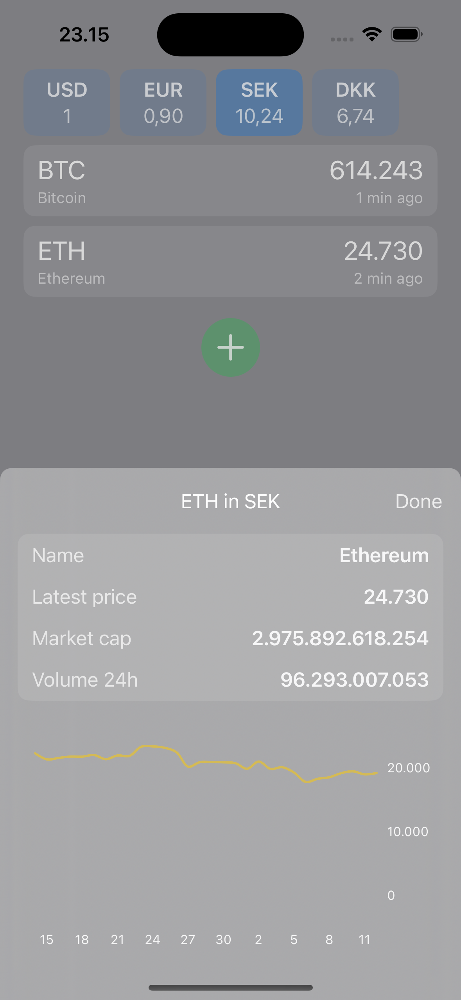
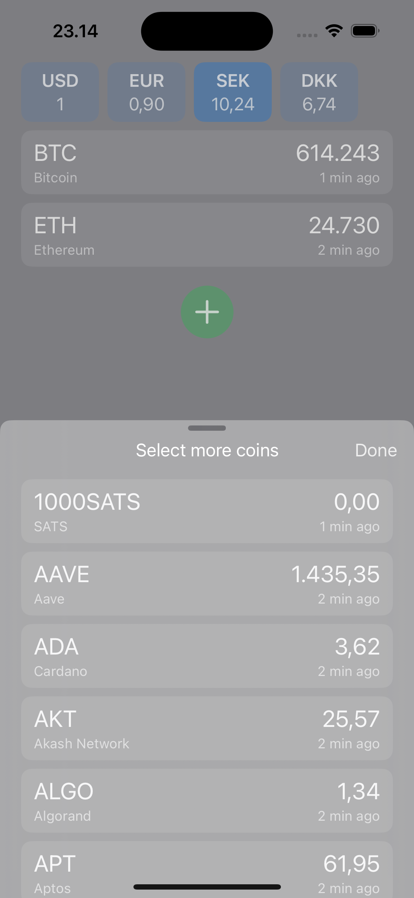
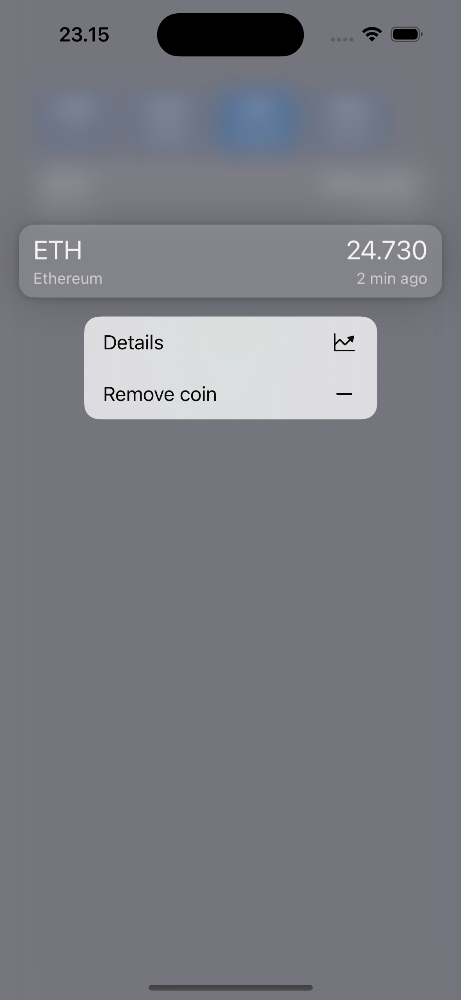

# Marshall App - Code Assignment

## Solution

NB: Adding documentation tomorrow (September 15th)

This is my solution to the task below. I'd say it satisfies all the requirements, including the extra points, except that I haven't added any unit tests. I did prepare for that, by making my clients (that fetch data) testable.

- Coins can be added or removed from the list
- Tap on a coin to see more details, such as a graph of the past month
- Fiat currencies update live on launch and every 5 minutes (mock client every 10s)
- Coin prices update on launch, when a new coin is added, and on pull to refresh

### Screenshots

### Video

https://github.com/user-attachments/assets/2b86e7aa-2e41-4da2-96f0-a5f2d94e5e44

## Task
You are tasked with making an app that displays a list of cryptocurrencies for a group of users in the USA and Sweden. Each user should be able to get the default prices in USD and then be able to switch the prices to SEK. Use as many data points as you deem necessary to make the user experience valuable to the end user. Make assumptions that you think are necessary in delivering this app. Prices should be displayed in USD. Users should be able to switch currency to SEK in the app and get updated prices.

## Requirements
- Make sure the project is compiling
- Provide at least 3 screens
- Push everything you want to submit
- Avoid using beta/canary Android Studio
- Kotlin for Android
- Swift and SwiftUI for iOS
- Write according to a clean code

## Extra points for
- Unit tests
- Modularization
- Being creative (UI/UX)
- Providing documentation
- Currency exchange rates are not hardcoded

## Final Deliverable
- Source Code on a public Git repository (preferably Github)
- Any documentation you think that’s necessary
- Give us a code that makes you proud!

## Help
You can use any endpoints, but here is one to help you out: https://api.wazirx.com/sapi/v1/tickers/24hr
