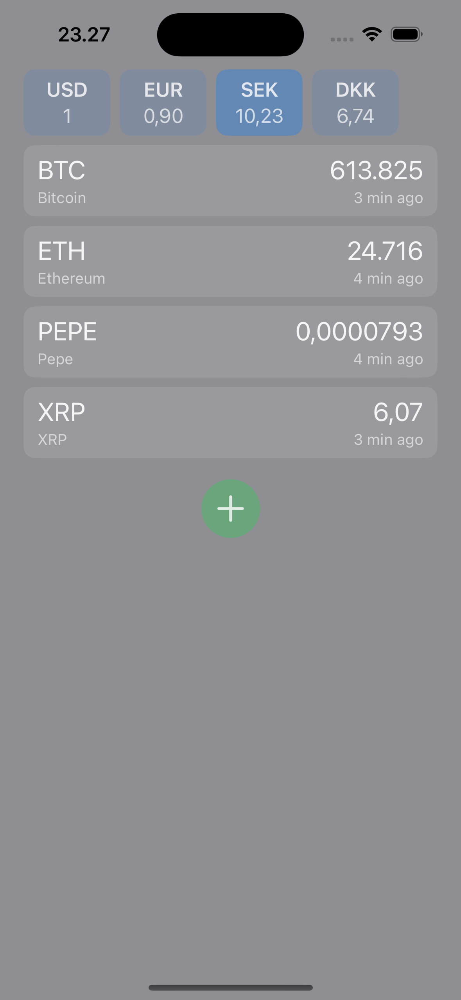

# Marshall App - Code Assignment

## Solution

This is my solution to the task below. I'd say it satisfies all the requirements, including the extra points, except that I haven't added any unit tests. I did prepare for that, by making my clients (that fetch data) easily testable.

#### Features

- Coins can be added or removed from the list
- Tap on a coin to see more details, such as a graph of the past month
- Fiat currencies update live on launch and every 5 minutes (mock client every 10s)
- When you select a fiat currency, prices are automatically converted everywhere
- Coin prices update on launch, when a new coin is added, every minute

#### Architecture

Normally, for a complex app I would use something like TCA, but this is simple and I wanted to be pragmatic, and also not have any dependencies. The approach I use is a form of MVVM, with the following layers:

- `Clients`: Only provide data, such as coin prices
- `ViewModels`: Handle the logic of the views, but without caring about the particular framework the views are implemented in
- `View`: Display the output of the ViewModels, and send actions, such as button presses, back

I generally prefer a pragmatic, but structured approach where I don't give every `View` a `ViewModel`. Instead, for simpler views that need very little internal logic, I use `ViewStates`. These only serve to package up all the input a `View` needs, and do simple formatting, like converting a date to a string. Some trivial views don't even have `ViewStates', I just pass in the values directly.

Whenever possible, I avoid mutable state and let viewstates and similar things be computed properties. `@Observable` makes that a lot easier in practice. For example, when you change the preferred currency, I have to call a function like `updatePrices`, instead all the viewstates that depend on the exchange rate are computed properties, and they are automatically be called by SwiftUI when needed.  

#### Combine

Normally I often use `@Observable` or `AsyncSequence`, but I worked with Combine a lot before (and RxSwift before that) and it's a great framework. Powerful and fast. Since it looks like you prefer it, I used it in a few places that made sense.

#### The clients

The clients are completely agnostic to how they are used, so they are built in a very generic way. Since we want to make things testable, they come in three forms, `live`, `test` and `mock`. The first explains itself, and `test` provides a stable output so it lends itself to unit tests. The last one returns random values, but bahaves more like a `live` client, so it is suitable during development, until the `live` version is in place. Or when you want to test certain scenarios in the app. Or just save credits on fixer.io since they only allow 100 free calls!

Instead of defining a protocol and having three different implementations, I use a "witness" approach. So instead of:

```Swift
protocol CoinPriceProvider {
    func price(for: CoinID) async -> Double
}
```
and
```Swift
struct LiveCoinPriceProvider: CoinPriceProvider {
    func price(for: CoinID) async -> Double {
        // call API and return a Double
    }
}
```
We do
```Swift
struct CoinPriceProvider {
    var price: (CoinID) async -> Double
}
```
and then
```Swift
let liveCoinPriceProvider = CoinPriceProvider(
    price: { coinID in
        // Code that calls API and returns a Double
    }
)
```
This approach has advantages and drawbacks. It is more flexible in some ways, more limited in others.

### Screenshots



### Video

https://github.com/user-attachments/assets/2b86e7aa-2e41-4da2-96f0-a5f2d94e5e44

## Task
You are tasked with making an app that displays a list of cryptocurrencies for a group of users in the USA and Sweden. Each user should be able to get the default prices in USD and then be able to switch the prices to SEK. Use as many data points as you deem necessary to make the user experience valuable to the end user. Make assumptions that you think are necessary in delivering this app. Prices should be displayed in USD. Users should be able to switch currency to SEK in the app and get updated prices.

## Requirements
- Make sure the project is compiling
- Provide at least 3 screens
- Push everything you want to submit
- Avoid using beta/canary Android Studio
- Kotlin for Android
- Swift and SwiftUI for iOS
- Write according to a clean code

## Extra points for
- Unit tests
- Modularization
- Being creative (UI/UX)
- Providing documentation
- Currency exchange rates are not hardcoded

## Final Deliverable
- Source Code on a public Git repository (preferably Github)
- Any documentation you think that’s necessary
- Give us a code that makes you proud!

## Help
You can use any endpoints, but here is one to help you out: https://api.wazirx.com/sapi/v1/tickers/24hr
